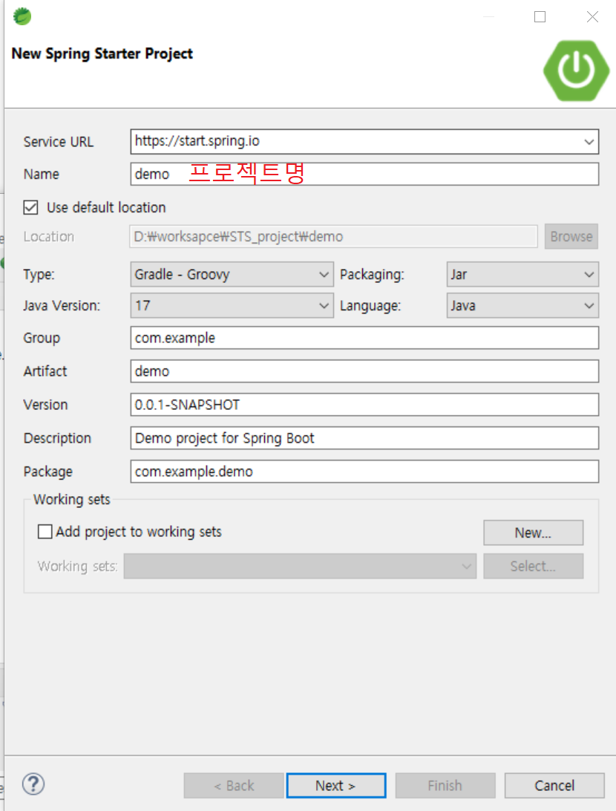
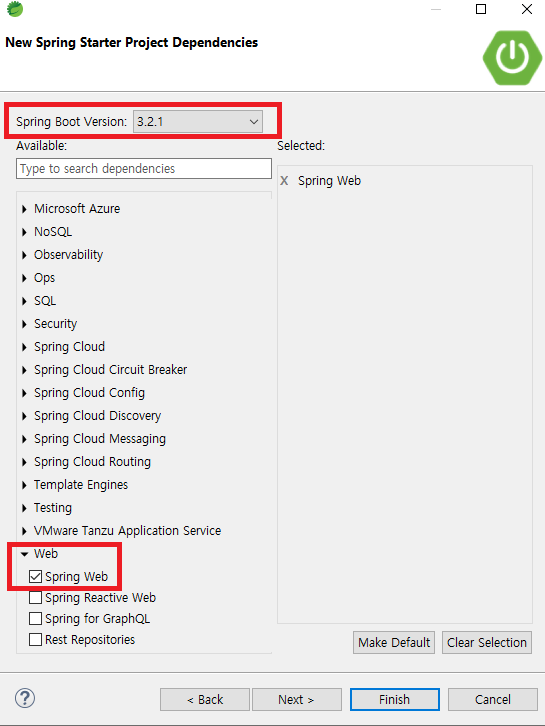
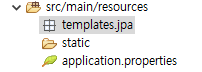

---
layout:
  title:
    visible: true
  description:
    visible: false
  tableOfContents:
    visible: true
  outline:
    visible: true
  pagination:
    visible: true
---

# 5.프로젝트 셋업

#### STS 다운로드 및 설치

아래에서 STS 를 다운 설치 한다. 각 OS 환경에 맞는 STS 를 다운한다.\
[https://spring.io/tools](https://spring.io/tools)

* jar 파일로 다운로드 되며,다운로드 받은 경로에서 명령 프롬프트(cmd) 를 실행하여  아래 명령어를 실행해서 압축해제 한다.

```powershell
폴더경로>java -jar spring-tool-suite-4-4.21.0.RELEASE-e4.30.0-win32.win32.x86_64.self-extracting.jar
```

<figure><figcaption></figcaption></figure>

* STS 실행\
  압축을 해제한 폴더 내에서 SpringToolSuite4.exe 파일을 더블클릭하여 실행
* 작업할 폴더 를 설정 후 Launch 를 클릭하여 실행\
  

#### 스프링부트프로젝트 생성

* Create new Spring Starter Project 를 클릭 (안보인다면 File - new 에서 확인)


<figure><figcaption></figcaption></figure>

*   프로젝트 Dependency를 설정하는 화면이다.\
    환경에 맞는 스프링부트버전을 선택하고\
    "Spring Web" 정도만 체크하고 "Finish" 를 클릭하여 설정을 마친다.

    <div align="left">

    <figure><figcaption></figcaption></figure>

    </div>

#### 프로젝트 실행

<figure><figcaption></figcaption></figure>

* 프로젝트에 마우스 오른쪽 클릭하여 Run As -> Spring Boot App 을 클릭하게 되면 콘솔탭에서 로그가 올라오면서 서버가 실행되는것을 확인 할 수 있다.
